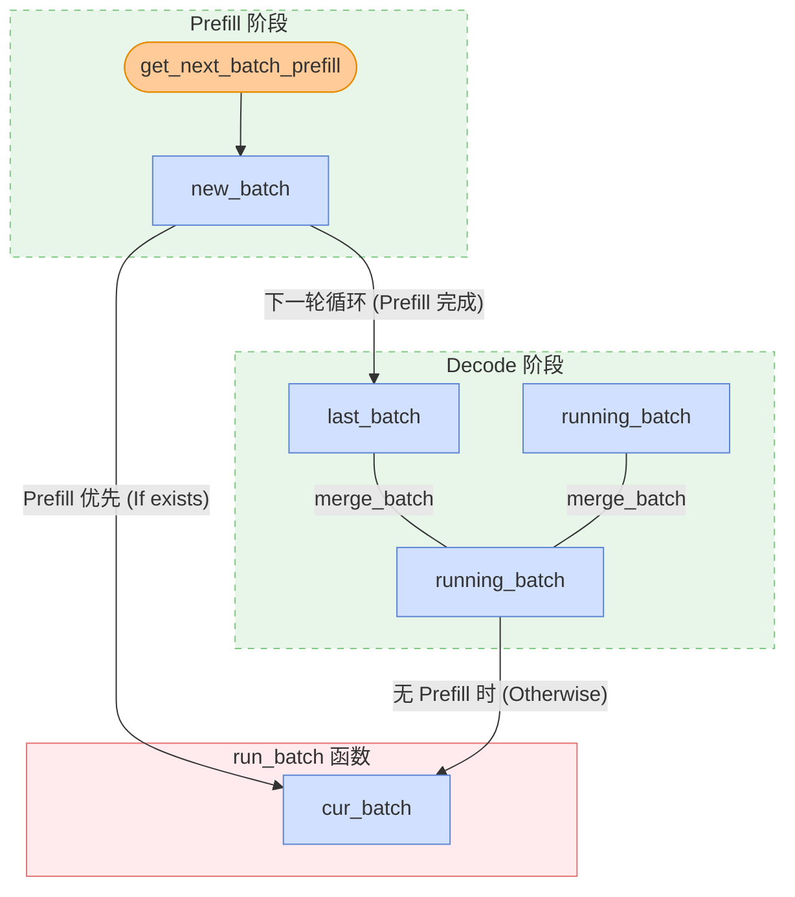

# 从 KV Cache 到 Overlapped Scheduling，一文读懂 SGLang 的调度巧思

想要系统性学习 SGLang Scheduler 的想法已经有一年了。大概在 24 年 11 月，当时我和几个朋友一起写了 [SGLang Code Walkthrough](https://github.com/zhaochenyang20/Awesome-ML-SYS-Tutorial/blob/main/sglang/code-walk-through/readme-CN.md)，但是当时止步于 KV Cache Management 和 Scheduler 分析，并未更进一步。从那时起，已经有了一整年，SGLang 项目也发生了翻天覆地的变化。但是，在我看来，Scheduling 算法本身早已收敛，最大的创新还是 24 年 12 月时，怜悯主力完成的 [zero-overhead batch scheduler](https://lmsys.org/blog/2024-12-04-sglang-v0-4/#zero-overhead-batch-scheduler)。此后，SGLang 很长时间的优化都是在 MOE 架构上。我自己也一直在忙着和诸多 RL framework 打交道，学习 SGLang KV Cache 和 Scheduler 的想法就一直搁置。但是，这个事情必然是悬在我心上的，否则经常看到在 SGLang 的各种技术讨论群里，大家聊的内容有许多我都毫不了解，让人产生了深深的技术焦虑。

更进一步，Junrong（Qwen RL Infra team 成员，也是 SGLang RL 老队友）有次给我说过，“现在感觉，很多时候 RL infra 的上限，其实取决于对 SGLang 和 Megatron 本身的理解程度”。他这话时常点醒我，对推理和训练系统本身的深刻认知，是推动 RL infra 发展的关键。事实也是如此，之前本人写了非常多 RL 系统深思，比如：

1. [深入浅出 DeepSeek MoE，EP 与 FSDP 经典二次开发](../../rlhf/sys-design/readme-4.md)
2. [RL 系统深思：深入理解权重更新机制](../../rlhf/sys-design/readme-1.md)
3. [RL 系统深思：FSDP 训练后端](../../rlhf/sys-design/readme-2.md)

这篇文章会 follow 以上三篇文章的思路，深入理解 SGLang 的调度系统，从 KV Cache 到 Overlapped Scheduling，一文读懂 SGLang 的调度巧思。

【感谢刘芷溢的 [SGLang Scheduler 技术变迁](https://zhuanlan.zhihu.com/p/1969077475129688722)原文】

考虑到 Scheduling 系统几乎是 SGLang 最复杂的中心组件，为了便于理解，这篇文章的写作思路有过多次改动。总体上我会先单独抽出几个重要的 class 和数据结构，接着再从整体上分析调度器的工作流程。

## Key Class and Data Structure

首先，回顾下 SGLang 的两个粗浅的架构图：

### Scheduler

Scheduler 通过如下的核心全局状态来管理所有的 active request：

1. `waiting_queue`：顾名思义，`waiting_queue` 是一个优先队列，用于存放所有的 active request。所有还没有完成 prefill 的 request 和在 decode 阶段被 retract 回来的 request 都会被放入队列中；根据优先级决定出队顺序。

2. `new_batch`：即将进入 prefill/extend 阶段的 requests。考虑到 chunked prefill，超出了 chunk size 的 request 会被拆分成多个 chunk，分别进行 prefill/extend。结束了 prefill/extend， `new_batch` 在下一轮循环中转为 `last_batch`，随后被 merge 到 `running_batch` 中。

3. `running_batch`：即将进入 decode 阶段的 requests。如果 decode 期间可用 kv cache 不足，`Scheduler` 会通过  `retract_decode`  从  `running_batch`  中撤回某些 requests，将其返回到  `waiting_queue`。（PS：坦诚说 `running_batch` 和 `new_batch` 这两个命名至少在我看来，是有些误导性的。可能更准确的说法是 `prefill_batch` 和 `decode_batch`）

4. `cur_batch`：在 Scheduler 主循环 `run_batch` 函数中当前正在被处理的 requests。注意到 SGLang 是 prefill first 的，当不存在新的 prefill batch 时，才进入 decode 阶段。因此，当 `new_batch` 存在时，`cur_batch = new_batch`，否则 `cur_batch = running_batch`。

